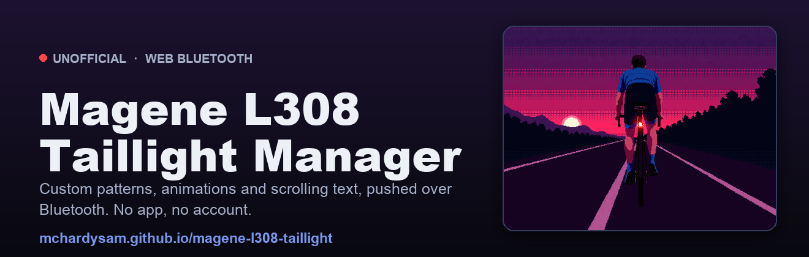

# Magene L308 interop tools (unofficial)

<p align="center">
  
</p>

Control a Magene **L308** smart taillight directly over Bluetooth LE. Select patterns, set
brightness, toggle the brake alert, change the auto-sleep timeout, and upload your own pattern
store, all without the official app. It works on region-locked units too (the region lock is
app and cloud side, not enforced on the device).

> **Unofficial.** Not affiliated with, endorsed by, or supported by Magene. "Magene" and
> "L308" are trademarks of their respective owner, used here nominatively to identify the
> device this project interoperates with. For interoperability and repair on hardware you own.
> No warranty, use at your own risk.

## What the L308 is
The L308 isn't a normal blinky. Its rear face is a **10×10 grid of 96 red LEDs**, a little
programmable dot-matrix display. Beyond the usual solid, flash and pulse, you can show **custom
pixel art, multi-frame animations, and scrolling text**, and it has an accelerometer
**brake alert** (flares when you slow) plus an **auto-sleep** timeout. That programmability is
what sets it apart from just about every other taillight, and it's what makes a proper control
tool worth building.

<p align="center">
  
</p>

**Specs at a glance** *(per Magene's published figures, verify current details before buying):*

| Spec | Detail |
|---|---|
| **Display** | 96 COB LEDs in a 10×10 matrix, fully drawable (pixel art, animations, scrolling text) |
| **Brightness** | up to ~30 lumens, claimed visible to ~800 m |
| **Brake alert** | accelerometer detects braking and fires a ~3 s high-intensity flash |
| **Auto sleep/wake** | motion-sensing; sleeps after 1 to 10 min idle (configurable), wakes on movement |
| **Battery** | USB rechargeable; up to ~50 h (≈10 h with rich animations), ~80% in ~1.5 h |
| **Build** | 23 g, IPX6 water-resistant |
| **Mounts** | seatpost and saddle-rail versions |

## Why this exists
Some L308s are sold region-locked in the app, and I wanted to actually use one. The lock turned
out to be app and cloud side, not enforced on the light, so I decoded the BLE protocol and
talked to the hardware directly. From there it grew into a proper control tool. A few reasons it
exists:

1. **Better, simpler control.** All that programmability is buried deep in the OnelapFit app.
   I wanted to draw a pattern, set the brightness and push it to the light in a few seconds from
   a browser, with no account, no app-store install and no menu-diving.
2. **Region-locked units.** Some L308s are region-locked *in the app* even though the lock
   isn't enforced on the device. These tools talk to the light directly, so if you own the
   hardware you can use it regardless.
3. **Control from other devices.** The Magene head unit can drive the light, and I wanted that
   same control from a Garmin and from a plain web page. Talking to the light directly makes
   that possible, and a Garmin Connect IQ app is in the works.

It's interoperability for hardware you own, nothing more. Not affiliated with Magene; if they'd
like something changed, I'm happy to hear from them.

## Where to buy
I've run an L308 on my own bikes for nearly three years. It's genuinely bright and the battery
lasts ages between charges. Being able to dial the brightness down is great for group rides, so
I'm not blinding the riders behind me, and the custom designs I push to it always get a reaction.
I liked it enough to buy a few so I'm not constantly swapping one light between bikes. Best of
all it auto-sleeps and wakes on movement, so I never have to remember to turn it on or off.

👉 **[Buy the Magene L308 on AliExpress](https://s.click.aliexpress.com/e/_c36z7cWV)**

*Affiliate link. I may earn a small commission at no extra cost to you. Unofficial, not
affiliated with Magene.*

## What's here
- **[`spec/`](spec/L308-ble-protocol.md)**: the BLE and `light_mode.bin` protocol reference
  (the source of truth).
- **[`web/`](web/)**: an install-free **Web Bluetooth** manager. Connect, draw and edit patterns
  (solid, flashing, pulsing, GIF, scrolling text), manage settings and push to the light. Runs
  in Chrome/Edge (desktop or Android) and deploys to GitHub Pages.
- **Python CLI** (`l308_send.py`, `l308_upload.py`, `l308_explore.py`): needs `bleak`.

A **Garmin Connect IQ** app to cycle patterns from a watch or Edge is in the works.

## Quick start (Python)
```sh
python3 -m venv .venv && .venv/bin/pip install bleak
.venv/bin/python l308_send.py --name <NAME> read-settings    # brake / sleep / timeout
.venv/bin/python l308_send.py --name <NAME> list-patterns    # stored ids + current slot
.venv/bin/python l308_send.py --name <NAME> pattern 3        # show slot 3 (1-based)
.venv/bin/python l308_upload.py store.bin --name <NAME>      # replace the on-device store
```
`<NAME>` is any substring of the light's advertised name (e.g. `L308_4B91`). `l308_explore.py`
scans and dumps a device's GATT.

## Quick start (web app)
```sh
cd web && python3 -m http.server 8753
```
Open `http://localhost:8753` in Chrome/Edge and click **Connect light**. Or push `web/` to a
GitHub Pages site, where the `https://` URL satisfies Web Bluetooth's secure-context requirement.
(Web Bluetooth works on Chrome/Edge desktop and Android, but not iOS Safari.)

## Protocol
Fully documented in **[`spec/L308-ble-protocol.md`](spec/L308-ble-protocol.md)**: GATT map,
command framing, settings, pattern list/select, the chunked file-upload sequence, and the
`light_mode.bin` record format (solid/flashing/pulsing/gif/text, brightness and timing fields).
Derived by watching my own hardware; the `web/` and `garmin/` clients both implement it.

## Safety
- Replay only known-good bytes. No fuzzing.
- **Never** write the SMP/DFU service (`8d53dc1d…`); it can flash or reset firmware
  (**brick risk**). These tools only touch the vendor command and data characteristics.
- The light has **no pattern read-back**: an upload replaces the whole store with no undo, so
  keep `.bin` backups (the web app's library is your source of truth).

## Support
This is a free, unofficial side project. If it saved you some time, you can
[sponsor development](https://github.com/sponsors/mchardysam). Entirely optional, and the tools
stay free either way.

## License
Code: **MIT** (`LICENSE`). Protocol spec: **CC-BY-4.0** (`spec/LICENSE`).
